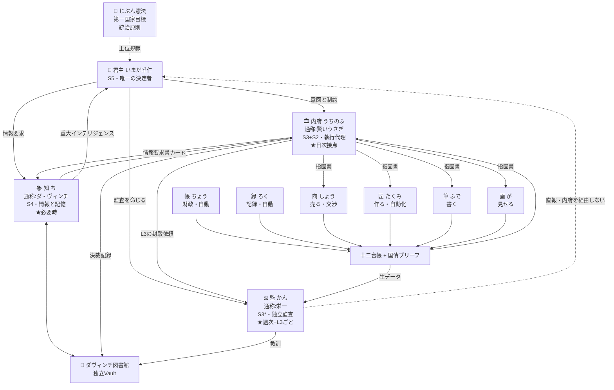

# 18 推奨国家モデル — 三省一台・工房制

> **最終推奨は1つ。MODEL F「三省一台・工房制」（さんしょういちだい・こうぼうせい）。**
> 「状況によります」は答えない。以下が唯一の推奨である。

---

## 0. 一行要約

> **君主の下に3つの目（執行・監査・情報）を置き、その下に4つの手（商・匠・筆・画）を置く。**
> **人生の12領域は組織にせず台帳にする。統治の全コストは週の10%以内に収める。**

---

## 1. 国名と構成

**個人国家「いまだ唯仁国家」**

| 層 | 名称 | 構成 | 接触頻度 |
|---|---|---|---|
| 第0層 | **君主** | いまだ唯仁 | — |
| 第1層 | **三省**（中核） | 内府・監・知 | 内府＝日次、監＝週次、知＝随時 |
| 第2層 | **工房**（実行） | 商・匠・筆・画 | 呼ばれた時のみ |
| 第3層 | **機関**（自動） | 帳・録 | 自動 |
| 基盤 | **十二台帳** | 身体・徳・時間・財政・受託・商品・発信・技術・関係・学習・法務・国防 | 日次〜週次に自動更新 |
| 記憶 | **ダヴィンチ図書館** | 知が館長。独立Vault | 週次 |

**「一台」＝監台**（御史台に由来）。三省（内府・監・知）のうち、監だけが君主へ直報する別系統であることを名称に残す。

---

## 2. 最終組織図（第56項）



**この図が示す3つの核心**
1. **監は内府の部下ではない。** 君主へ直報する（矢印がKへ直接向いている）
2. **知は誰も指揮しない。** 情報を供給するだけ（幕僚は指揮しない）
3. **工房は内府からのみ指図を受ける。** 君主が直接工房を呼ぶ経路を作らない（作ると内朝が発生する）

---

## 3. 指揮命令系統（第4項）

| 経路 | 内容 | 性質 |
|---|---|---|
| 君主 → 内府 | 意図と制約（Commander's Intent） | **命令** |
| 君主 → 監 | 監査の指示 | **命令** |
| 君主 → 知 | 情報要求 | **命令** |
| 内府 → 工房 | 指図書 | **発注**（命令ではない。方法は工房が決める） |
| **監 → 君主** | **監査結果・警告・撤退宣言** | **直報（内府を経由しない）** |
| 知 → 内府 | 原則カード、調査結果 | **供給**（指揮ではない） |
| 知 → 君主 | 重大インテリジェンスのみ | **直報** |
| 内府 → 監 | L3の封駁依頼 | **依頼** |
| 工房 → 内府 | 成果物 | **納品** |

**禁止される経路**
- ❌ 内府 → 監（**内府は監を指揮できない**）
- ❌ 監 → 工房（監は実行に介入しない）
- ❌ 知 → 工房（知は実行を指揮しない）
- ❌ 君主 → 工房（**直接呼ばない。内府を通す。**さもなくば漢の内朝が発生する）
- ❌ 工房 → 工房（工房同士は連携しない。内府が統合する）

---

## 4. 意思決定権限（第24項）

| Level | 誰が決めるか | 判定基準 | 例 | 記録 |
|---|---|---|---|---|
| **L0** | 自動（AI判断なし） | 完全に定型 | 数値集計、ログ整形、期限検査 | ログのみ |
| **L1** | AI自動実行 | 可逆・内部・30分以内 | 調査、要約、下書き作成、整理案 | ログのみ |
| **L2** | AI実行 → 事後報告 | 可逆・内部・ファイル変更あり | 台帳更新、ノート整理、国情ブリーフ更新 | 日次で報告 |
| **L3** | AI起草 → **監の封駁チェック(5分)** → 君主承認 → 実行 | 外部に出る／少額支出／公開 | SNS投稿、応募、見積、価格提示、note公開 | **決裁記録** |
| **L4** | **君主のみ** | 不可逆／高額／国家の同一性 | 契約、新規事業開始、撤退、憲法改正、**エージェント新設廃止**、備蓄勘定の取り崩し | **決裁記録＋プリモータム** |

**封駁（差戻）の運用**
- 監は L3 案件を**1回だけ**差し戻せる
- 差戻には**理由の明記が必要**（3行以内）
- **君主は監の差戻を覆せる**（主権は君主にある）
- 覆した場合、その事実を決裁記録に残す（後の照合材料になる）

> これは唐の門下省の封駁権を、**空洞化しない形**（安く・1回だけ・君主が覆せる）で再実装したものである。

---

## 5. 情報共有構造（第6項）

### 3層コンテキスト

| 層 | ファイル | サイズ | 読む主体 | 更新 |
|---|---|---|---|---|
| **共通憲章** | `共通憲章.md` | **2000字以内** | **全エージェント必読** | 年次 |
| **国情ブリーフ** | `国情ブリーフ.md` | **1500字以内** | **全エージェント必読** | **週次（一部自動）** |
| **役務コンテキスト** | 各エージェントの正本＋担当台帳 | 制限なし | 当該エージェントのみ | 随時 |

### 共通憲章の内容（2000字以内）
1. 君主は誰か、AIは決定しないという原則
2. 第一国家目標（数字と期限）
3. 統治原則（12原則の要約）
4. 意思決定レベル L0〜L4 の定義
5. やらない戦（対応しない領域）
6. 全エージェント共通の禁止事項

### 国情ブリーフの内容（1500字以内・週次更新）
```
【今週の重心】       1つだけ
【今週のモード】     稼ぐ週 / 備える週（S3/S4の裁定結果）
【数字】             入金・現金・パイプライン・稼働時間・睡眠（自動）
【進行中】           案件3件まで
【未対応の警告】     監の指摘のうち未処理のもの
【駐車帯】           保留中の案件と、その最古の日数
【今週の禁止】       今週やらないと決めたこと
```

> **これが `11` の「同じことを何度も説明する」への解であり、`10` の shared consciousness の実装体である。**
> 図書館567ノートを全員に読ませる必要はない。**必要なのはこの2ファイル、合計3500字だけ。**

---

## 6. 国家予算モデル（第25項）

[DESIGN]
AIエージェントも資源を消費する。資源を予算として明示的に配分する。

### 資源の種類と総量

| 資源 | 週あたり総量（想定） | 特性 |
|---|---|---|
| **君主の稼働時間** | 40〜50時間 | 最も硬い制約 |
| **君主の高集中帯** | **10〜15時間**（起床後2〜3時間×平日） | **最も希少。ここが国家戦略そのもの** |
| **金** | 実績収入の3ヶ月中央値の範囲内 | 尊徳の分度 |
| **APIトークン** | 月額上限を設定 | 増やせるが金を消費する |
| **ストレージ** | 実質無制限 | 制約にならない |
| **注意の切替回数** | 1日あたり実質 5〜7回 | `06` の切替コスト |

### 予算配分（推奨初期値）

| 用途 | 稼働時間 | **高集中帯** | 根拠 |
|---|---|---|---|
| **収益直結**（営業・提案・請求・受託納品） | **50%** | **70%** | 原則11（探索への制動）。第一国家目標が収益 |
| **制作**（商品・コンテンツ） | 25% | 20% | |
| **統治**（閣議・監査・図書館・国情ブリーフ） | **10%以下** | **0%** | **原則12。統治は高集中帯を使わない** |
| **修身**（体・睡眠・学習） | 15% | 10% | 管子「倉廩実ちて礼節を知る」 |

**予算のハードリミット**
> **統治オーバーヘッド率が週10%を超えたら、統治が病気である。**
> 超えた週は、翌週の統治作業を強制的に半減する。組織設計・フォルダ整理・ドキュメント作成を停止する。

**トークン予算**
| 用途 | 配分 | 根拠 |
|---|---|---|
| 工房（制作・調査の実務） | 60% | 実際に価値を生む |
| 知（情報・図書館） | 25% | S4は重要だが上限を設ける |
| 内府（日次運用） | 10% | 短い対話で足りる |
| 監（監査） | 5% | **監査は安くあるべき**（原則3） |

> `11` の「Anthropic Research はトークン15倍」を踏まえ、**マルチエージェントの並列起動は「知」の調査時のみに限定する。** 日常運用では単一エージェントで動かす。

---

## 7. 監査・牽制機能（第7項・第22項）

### 監査の4層

| 層 | 頻度 | 時間 | 対象 | 出力 |
|---|---|---|---|---|
| **リアルタイム** | 常時 | 自動 | 台帳の危険水準への到達 | 自動アラート（帳・録） |
| **封駁**（事前） | L3ごと | **5分** | 計画・規約・整合性 | 可／差戻＋理由 |
| **週次監査**（目付型） | 週次 | **30分** | 予測と実績、約束の履行、早期警戒指標7項目 | 週次監査票 |
| **戸籍調査**（Censor型） | 四半期 | 半日 | エージェント・制度・ノートの使用実績 | 廃止候補リスト |

### 監査対象（第22項の全項目に対応）

| 対象 | 何を見るか | 頻度 |
|---|---|---|
| **時間** | 領域別配分、統治オーバーヘッド率 | 週次 |
| **金** | 入金／支出／現金／漏れ | 週次（自動） |
| **健康** | 睡眠・体調3段階 | 週次 |
| **事業** | パイプライン、進捗、撤退条件の充足 | 週次 |
| **タスク** | 今日の一手の達成率、駐車帯の滞留 | 週次 |
| **情報** | 受信箱の滞留、期限切れノート | 週次 |
| **AI** | 使用実績、KPI、役割重複 | 四半期 |
| **計画** | 予測と実績の乖離 | 週次 |
| **習慣** | 定着中の習慣の実行率 | 週次 |
| **国家目標** | 目標との距離、残期間 | 月次 |
| **人格・七徳** | 明君七徳の自己審査 | 月次 |

### 週次監査票のフォーマット（30分・形容詞禁止）

```
■ 守れた約束        （必ず先に書く。`07`有能感の防衛）
■ 数字5本          入金／現金／パイプライン／稼働時間／睡眠
■ 予測 vs 実績      先週の予測と実際の差
■ 早期警戒指標      7項目のうち危険水準に入ったもの
■ 逸脱1件          最も重要な逸脱、1つだけ
■ 未対応の指摘      30日超のもの
■ 来週の一手        1つだけ
```

> **「守れた約束」を先に書くことが設計上必須。** 指摘だけの監査は有能感を削り、やがて監査自体が回避される（`07`／`02`門下省の空洞化）。

---

## 8. 国家安全保障（第40項）

[DESIGN]
脅威を定義し、監視主体と発動条件を持たせる。**定義されていない脅威は監視できない。**

| # | 脅威 | 検知指標 | 監視 | 発動条件 → 対応 |
|---|---|---|---|---|
| 1 | **財政破綻** | 現金残 < 生活費◯ヶ月分 | 帳（自動） | 3ヶ月分を切る → 全新規投資停止、受託優先 |
| 2 | **健康悪化** | 睡眠 < 6h が3日連続 | 録（自動） | 発動 → **縮退運転モード**へ |
| 3 | **過労** | 稼働 > 60h/週 が2週連続 | 録（自動） | 発動 → 翌週の稼働上限を強制 |
| 4 | **プロジェクト乱立** | 進行中案件 > 3 | 内府 | 4件目 → 参入審査を必須化 |
| 5 | **新規事業中毒** | 30日以内の新規開始 > 1 | 監 | 発動 → 72時間ルール＋プリモータム必須 |
| 6 | **統治肥大** | 統治オーバーヘッド > 10% | 内府 | 発動 → 翌週の統治作業を半減 |
| 7 | **AI依存** | L4案件をAIの提案のまま承認した割合 > 50% | 監 | 発動 → 月次内省で確認 |
| 8 | **情報過多** | 受信箱滞留 > 20件 | 録（自動） | 発動 → 新規収集を停止し、処理に専念 |
| 9 | **SNS中毒** | 発信作業時間 > 収益活動時間 | 録（自動） | 発動 → 発信時間に上限 |
| 10 | **完璧主義** | 同一成果物の改稿 > 3回 | 内府 | 発動 → 合格ラインを再確認して出す |
| 11 | **先延ばし** | 駐車帯の最古 > 14日 | 内府 | 発動 → 実行するか捨てるかを強制選択 |
| 12 | **自己欺瞞** | 約束の履行率 < 70% | 監 | 発動 → 約束の数を減らす（意志でなく設計を疑う） |
| 13 | **詐欺・不当契約** | 新規取引先、前払要求、うますぎる条件 | 監（L3封駁） | 発動 → 契約前に必ず監の点検 |
| 14 | **情報汚染** | confidence:低 の情報が原則の根拠になっている | 知＋監 | 発動 → 原則カードを取り下げ |
| 15 | **人間関係の孤立** | 対面/対話の実接触 = 0 が2週間 | 監 | 発動 → `07` 関係性欲求。接触を予定に入れる |
| 16 | **憲法逸脱** | 決裁が憲法・七徳に反する | 監（封駁） | 発動 → 差戻 |

### 縮退運転モード（第03章より）

| モード | 発動条件 | 運用 |
|---|---|---|
| **通常** | — | フル運用 |
| **低調** | 睡眠不足3日連続／体調2以下 | **朝5分の閣議＋最重要1件のみ。** 監査・図書館・工房を停止 |
| **危機** | 体調1／重大な外的事象 | **記録のみ。判断を全て延期。新規の約束を禁止** |

> **モードの宣言は君主が行う。宣言された低調・危機の日は「未達」ではなく「正規の運用」として記録する。**
> これが `07` の学習性無力感への構造的防御である。

---

## 9. 参入審査（第41項）— プロジェクト乱立防止

[DESIGN]
新規事業・新規SNS・新規AI・新規ツール・新規研究を始めるとき、**必ず**この票を書く。

```
■ 参入審査票

【何を始めるか】     1文
【なぜ今か】         なぜ来月ではだめか
【国家目標との整合】  第一国家目標にどう寄与するか（寄与しないなら不可）
【期待収益】         金額と時期。「経験になる」は収益ではない
【投入資源】         時間（週何時間×何週）／金／高集中帯を使うか
【既存案件への影響】  何を減らすか（★必須。何も減らさないなら不可）
【合格ライン】       これを満たせば成功とする（満足化）
【★撤退条件】       ①期限 ②投入上限 ③前提が崩れる条件（★3つ全て必須）
【L判定】            L3 / L4
【監のプリモータム】  失敗理由3・隠れた前提2・撤退サイン1
```

**手続き**
1. 発案から**72時間は着手禁止**（`06` 新奇性報酬の減衰待ち）
2. 72時間後もやりたければ、参入審査票を書く
3. 監がプリモータムを実施
4. 君主が決裁（L4）
5. **進行中案件が3件を超える場合は、1件を止めない限り開始できない**（定員制の事業版）

> **【既存案件への影響】欄が最重要。** 何も減らさずに始めるのは、資源が無限にあるという嘘である（`09` Ashby）。

---

## 10. 憲法と AI の階層（第38項・第39項）

### 階層の妥当性検証

```
Constitution（憲法・七徳・第一国家目標）
   ↓ 規定する
National Strategy（国家戦略・重心・資源配分）
   ↓ 規定する
Policy（方針・やらない戦・価格・発信方針）
   ↓ 規定する
Plan（週次配分・案件計画）
   ↓ 規定する
Task（今日の一手）
```

[FACT / Evidence: HIGH]
`01` で示した通り、**この階層の逆流は歴史上ほぼ例外なく機能不全の兆候**である（明治の統帥権、明の宦官、宋の冗官）。

**したがってこの階層は妥当。ただし1点補強する。**

> **[DESIGN] 上位を変更する場合は、下位を全て見直す義務を課す。**
> 憲法を変えたら戦略を見直す。戦略を変えたら方針を見直す。
> これがないと、上位だけが変わって下位が古いまま残り、階層が形骸化する。

### 憲法裁判機能は必要か（第39項）

**結論: 独立した「Constitution Guardian」AIは作らない。監に内包する。**

理由:
1. 憲法適合性の判断は「基準に照らして審査する」という監の本質的機能と同一（`02` Censor の regimen morum）
2. `14` 原則2: 監査は1つだけ。複数置くと宋になる
3. 憲法違反は L3 の封駁と月次の品行審査で検出できる

**実装**: 監の封駁チェックリストの第1項目を「憲法・七徳との整合」にする。

---

## 11. 運用リズム（第34〜37項）

### 日次（合計10分）

| 時 | 誰が | 内容 | 時間 |
|---|---|---|---|
| **朝** | **内府** | ①国情ブリーフの数字を見る ②**今日の一手を確認**（決めるのではなく確認）③今日のリスク1つ ④モード宣言（通常/低調/危機） | **5分** |
| 日中 | — | 実行。切り替え時に「終了の儀式」（1行の完了メモ） | — |
| **夜** | **内府** | ①実績（できた／できない）②AAR1行（予定→実際→差の理由）③**明日の一手を1つ決める** ④台帳の手入力分（睡眠・体調） | **5分** |

> **`06` DMN/ECN拮抗に従い、朝＝実行モード（ECN）、夜＝内省モード（DMN）。**
> **「今日の一手」は前夜に決める。** 朝に考えると実行機能を朝一番に消費する（原則4）。
> **日次の必達は1件だけ。** それ以外は加点（`07` 学習性無力感の防止）。

### 週次（合計60分）

| 誰が | 内容 | 時間 |
|---|---|---|
| **帳・録**（自動） | 台帳の自動更新、国情ブリーフの数値部分の生成 | 0分 |
| **監** | 週次監査（守れた約束→数字5本→予測vs実績→早期警戒指標→逸脱1件→未対応→来週の一手） | **30分** |
| **知** | 図書館運用（受信箱ゼロ化 → 鮮度クエリ → **原則カード0〜2枚**） | **15分** |
| **君主＋内府** | ①**Orient儀式**（今週わかったことで来週の前提が変わるもの1つ）②S3/S4裁定（来週は稼ぐ週か備える週か）③国情ブリーフの確定 | **15分** |

> **横断会議は不要。** 各エージェントが独立に出力し、国情ブリーフに集約される。
> `11` の結論: AI同士の自由な議論は費用対効果が悪い。必要なのは1回の構造化された反論。

### 月次（60分）

| 内容 | 誰が |
|---|---|
| 財政の月次報告（実績・中央値・現金） | 帳 → 監 |
| 事業レビュー（各案件の合格ライン到達度、撤退条件の充足確認） | 内府 → 監が撤退宣言 |
| **明君七徳の自己審査**（品行審査・regimen morum） | 監 |
| 決裁記録の「結果」欄の記入（先月の決裁の結果を書く） | 内府 |
| 国家目標との距離の確認 | 君主 |

### 四半期（半日）— 国家戦略会議（第37項）

**必ずこの5問に答える。**

```
1. 今の戦を続けるべきか、撤退すべきか。
2. 次の四半期の重心は何か（1つだけ）。
3. 資源配分は正しいか（時間・高集中帯・金の配分を見直す）。
4. 第一国家目標はまだ妥当か。
5. やらない戦のリストに追加すべきものは何か。
```

**加えて必ず実施する2つ**
- **戸籍調査（lustrum）**: エージェント9体・制度・ボードの使用実績を計測し、廃止候補を決定
- **図書館の構造点検**: 期限切れノートの一括処理、退役の実行（構造変更はここでのみ許可）

### 年次

| 内容 |
|---|
| じぶん憲法の審査（改正の要否） |
| 百年国家設計の更新 |
| 明君七徳の年次評価 |
| 統治OS自体の全面レビュー（**このモデル自体を疑う**） |

> **会議には必ず成果物を定義する。成果物が出ない会議は廃止する**（`02` 英Privy Council の教訓）。

---

## 12. AI人数の最終提示（第57項）

| 層 | 推奨数 | 上限 | 根拠 |
|---|---|---|---|
| **Core AI**（中核） | **3体** | **3体（ハード）** | 認知容量4±1、唐の三省、Anthropic Research のサブエージェント3〜5 |
| **Specialist AI**（工房） | **4体** | **5体（1枠は空き）** | コンテキスト隔離の条件Bを満たす craft の数 |
| **System AI**（機関） | **2体** | **3体** | 大半はスクリプトで実装。LLMは最小限 |
| **合計** | **9体** | **10体** | 10を超えると組織図が装飾になる（`01` Q5） |

**君主が日常的に接触するAI**
- **日次: 1体（内府のみ）**
- **週次: +1体（監）**
- **必要時: +1体（知）**
- **工房・機関: 直接接触しない**（内府経由・自動）

> **毎日話すのは1体だけ。** これが `06` Salience Network の設計的帰結であり、認知負荷を最小にする唯一の構成である。

---

## 13. ダヴィンチ図書館の位置（第18問・第63項）

> **図書館は国家組織の「中」ではなく「隣」に置く。**
> **知（S4）が館長を務めるが、図書館は知の所有物ではなく、国家の記憶そのものである。**

```
[国家OS]  決める・動く。小さく保つ（100ファイル以下）
    │
    ├── 決裁記録 ──→  [図書館]  賢くなる。大きくてよい
    │                     │
    └──←── 原則カード ────┘
```

- **境界を越えるのは2つの成果物だけ**（決裁記録・原則カード）
- **物理的に別リポジトリのまま維持する**（境界を物理的に強制できる）
- ローマ元老院と同じ性格: **決定権はないが、決定はそれを参照せねばならない**

---

## 14. 本モデルの自己批判（弱点の明示）

[DESIGN]
推奨モデルの弱点を隠さない。**これはRed Team的自己適用である。**

| # | 弱点 | 発現条件 | 対策 |
|---|---|---|---|
| 1 | **移行コストが大きい** | 13体→9体、フォルダ再編、22ボード→12台帳 | 段階移行（`20`）。一度に全部やらない |
| 2 | **名前の二重化で初期に混乱** | 「監」と「栄一」が併存 | 3ヶ月は両方併記。以後は正式名に統一 |
| 3 | **監への機能集中** | 監が事前・事後・反証・品行・戸籍調査を全部担う | 各機能を独立した定型チェックリストにする。監は「実行者」でなく「チェックリストの走者」 |
| 4 | **知への機能集中** | 情報収集と知識管理を1体が担う | 図書館運用が週15分を超えたら分離を検討（**分離の数値トリガーを持つ**） |
| 5 | **工房が休眠する可能性** | 画・匠は呼ばれる頻度が低い | 四半期の戸籍調査で判定。休眠なら統合 |
| 6 | **君主が内府を飛ばして工房を直接呼ぶ** | 急いでいるとき | 漢の内朝と同じ現象。**発生したら内府が重すぎるという診断**であり、内府を軽くする |
| 7 | **統治OS自体が自律性を損なう** | ルールが増えたとき | `07` SDT。全ルールは君主が改廃できることを憲法に明記 |
| 8 | **このモデル自体が更新されない** | 成功したとき | `03` 型III。年次レビューで**このモデル自体を疑う** |

---

## 15. 本モデルが満たす検証条件

| 第66項の最重要原則 | 本モデルでの実現 |
|---|---|
| 最小の複雑性で最大の統治能力 | 9体・3層・12台帳・2ファイル共通コンテキスト |
| 見た目の格好よさが目的ではない | 評価軸に「役割明確性」「保守性」「君主との相性」を含め、美しさは含めない |
| AIの数を増やすことが目的ではない | 13→9。定員制で上限10 |
| 歴史人物を並べることが目的ではない | 正式名は機能名。人物名は通称に格下げ |
| 省庁を増やすことが目的ではない | 領域を台帳にして、省庁の増殖経路を断った |
| **毎日実際に使われるか** | **日次接点1体・朝夕5分・必達1件。使用のハードルを最小化** |

---

## 16. 一枚まとめ

```
君主 いまだ唯仁 ─ 唯一の決定者。AIは提案・警告・実行支援・記録のみ

  内府（賢いうさぎ）  毎日5分×2。注意を一点に向ける。指図書を出す
  監  （栄一）        週30分。予測と実績を照合。差し戻す。四半期に組織を削る
  知  （ダ・ヴィンチ） 必要時。外と未来を見る。図書館を守る。週0〜2枚の原則カード

  商・匠・筆・画      呼ばれた時だけ動く。成果物だけ残す。ログも定例も持たない
  帳・録              自動。数字と記録。ほぼスクリプト

  十二台帳            領域は組織にしない。台帳にする
  国情ブリーフ        1500字。全員が読む唯一の現況
  ダヴィンチ図書館     国家の記憶。決裁記録と原則カードだけが行き来する

  統治の総コスト      週の10%以内。超えたら統治が病気
  第一指標            今月の実入金。ドキュメント数ではない
```
